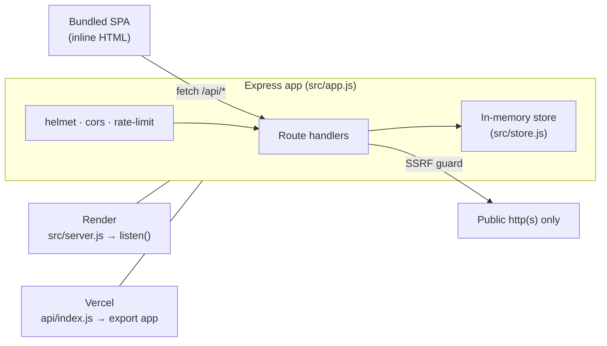
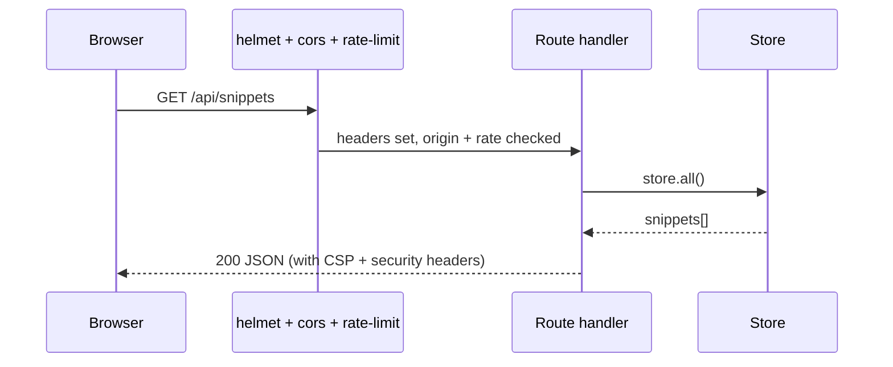

# SnipVault

Share code snippets with a link. A small, real Express service with a zero-build
single-page UI, shipped as one deployable unit and hardened against the OWASP
API top-ten basics.

**Live:** Render → _pending deploy_ · Vercel → _pending deploy_

`express` · `helmet` · `express-rate-limit` · `cors` · zero-build vanilla UI

---

## What it does

SnipVault stores short code snippets and serves them back through a JSON API and
a bundled web UI. It is deliberately small, but it is a genuine end-to-end app:
an API, a front end, input validation, security headers, rate limiting, and two
deployment targets from one codebase.

This is `v2`, the hardened version. It began life as `snipvault_v1`, a
deliberately insecure baseline that was run through an AgentIQ assessment; every
finding that scan produced is fixed here.

## Key features

| Feature | Detail |
| --- | --- |
| Snippet CRUD | Create, list, fetch, delete code snippets |
| Bundled UI | A single inline page, no build step, served by the API |
| Security headers | `helmet` with a content-security-policy |
| Rate limiting | 300 requests per minute per IP |
| Locked-down CORS | A single configured origin, or same-origin only |
| SSRF-safe preview | Link preview refuses private and metadata hosts |
| Bearer-gated admin | Stats route needs a token and leaks no secrets |
| Dual deploy | One codebase runs on Render (server) and Vercel (serverless) |

## Tech stack

- **Runtime:** Node.js 18+, ES modules
- **HTTP:** Express 4
- **Security:** helmet, express-rate-limit, cors, an SSRF host guard
- **UI:** a single inline HTML page (no framework, no bundler)
- **Hosting:** Render (long-lived server) and Vercel (serverless function)

## System architecture



The same `app` object is the whole product. `src/server.js` wraps it in
`app.listen()` for Render; `api/index.js` exports it as a serverless handler and
`vercel.json` rewrites every path to it. Nothing about the app changes between
the two.

## Request flow



## Project structure

```
snipvault_v2/
├── api/
│   └── index.js        # Vercel serverless entry (exports the app)
├── src/
│   ├── app.js          # Express app: middleware + routes
│   ├── config.js       # Env-only config, no committed secrets
│   ├── frontend.js     # The inline single-page UI
│   ├── server.js       # Render / local entry (app.listen)
│   └── store.js        # In-memory snippet store
├── vercel.json         # Route every path to api/index
├── .env.example        # Copy to .env locally (gitignored)
└── package.json
```

## Getting started

```bash
git clone https://github.com/adarshcod30/snipvault_v2.git
cd snipvault_v2
npm install
cp .env.example .env      # optional: set ADMIN_TOKEN to open the admin route
npm start                 # http://localhost:3000
```

## API reference

| Method | Path | Auth | Purpose |
| --- | --- | --- | --- |
| GET | `/` | – | Single-page UI |
| GET | `/api/health` | – | Liveness probe |
| GET | `/api/snippets` | – | List snippets |
| POST | `/api/snippets` | – | Create a snippet (`title`, `code` required) |
| GET | `/api/snippets/:id` | – | Fetch one (404 if absent) |
| DELETE | `/api/snippets/:id` | Bearer | Delete one |
| GET | `/api/search?q=` | – | Search (HTML-escaped output) |
| GET | `/api/admin/stats` | Bearer | Counts only, no secrets |
| GET | `/api/fetch?url=` | – | Link preview (public hosts only) |
| GET | `/go?next=` | – | Same-site redirect only |

## Security hardening (what changed from v1)

| v1 defect | v2 fix |
| --- | --- |
| Vulnerable `lodash` 4.17.11 | Dependency removed entirely |
| CORS `*` with credentials | Single configured origin, or same-origin |
| Committed `.env` | `.env` gitignored; `.env.example` only |
| No security headers | `helmet` with a CSP |
| No rate limiting | 300 req/min per IP |
| Hardcoded secrets in source | Env-only, no fallbacks |
| SQL-injection-shaped lookup | Integer-only lookup, no error leak |
| Reflected XSS in search | Output HTML-escaped |
| SSRF in link preview | Private + metadata hosts refused |
| Open redirect | Same-site paths only |
| Unauthenticated admin route | Bearer token required |

## Deployment

- **Render:** build `npm install`, start `npm start` (runs `src/server.js`).
- **Vercel:** `api/index.js` exports the app; `vercel.json` routes all paths to it.

## License

MIT.
